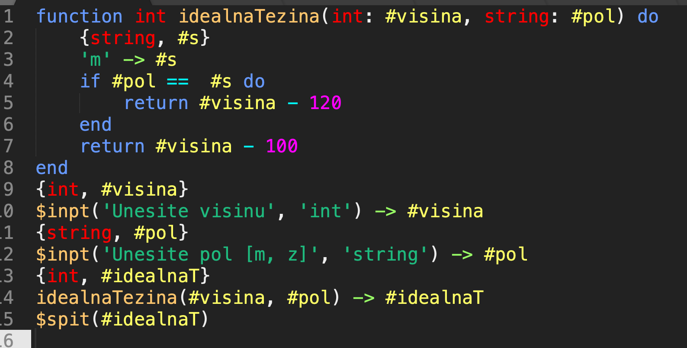

# Tok
Tok is python-like programming language that I created for Compilers course on School of Computing.

Tok is compiled on python code and currently supports **if** and **dont_f_stop_until** loops.
In the examples folder you can find some hm well ... examples.

Here is how pretty can it be, after writing your own sublime script for colloring:

